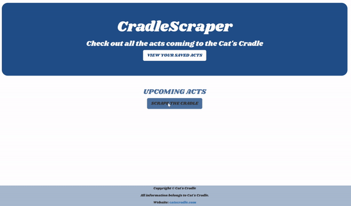
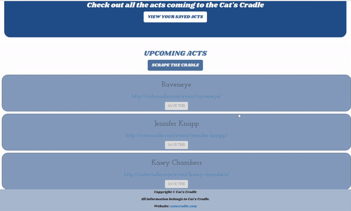

# CradleScraper
This full-stack application allows users to view and save upcoming performances at Chapel Hill's famous concert venue Cat's Cradle. 

## See it in action.

On the click of a button, the Cat's Cradle website is scraped and the upcoming acts appear.

Users can save acts by clicking the 'save' button and view them on a separate page, as shown above.

## Built With
MongoDB, Cheerio, JavaScript/jQuery, Handlebars, Node.js, Express, Bootstrap

## Author
Seton Raynor